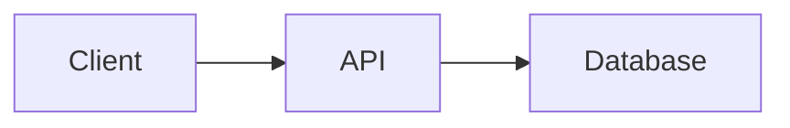
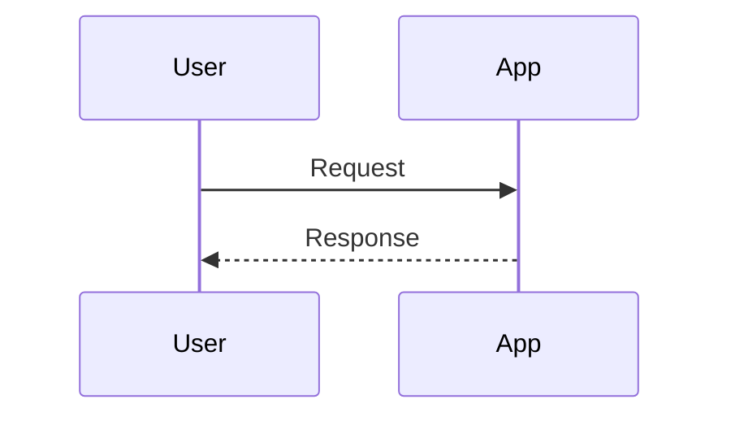

# Mermaid.NET

A .NET port of the official [mermaid/mermaid-cli](https://github.com/mermaid-js/mermaid-cli) that doesn't require Node.js. It takes a Mermaid definition file as input and generates SVG/PNG/PDF files as output, using your local browser instead of downloading one.

## Why Mermaid.NET?

- **No Node.js Required** - Built with .NET instead of Node.js
- **Uses Your Local Browser** - Automatically detects Chrome, Chromium, or Edge on your system
- **Lightweight** - No node_modules folders or npm dependencies. Only the minimal browser-interaction code from PuppeteerSharp is included — no unnecessary abstractions or unused features
- **Optional Browser Download** - Only downloads Chromium if you explicitly allow it
- **Full Feature Parity** - Supports all Mermaid diagram types, themes, CSS customization, and icon packs

## Installation

### Download Pre-built Binaries

Download from the [Releases](https://github.com/yourusername/Mermaid.NET/releases) page. Two flavors are available:

**Framework-dependent** — smaller binaries, requires [.NET 10.0 Runtime](https://dotnet.microsoft.com/download/dotnet/10.0) installed on the target machine:

- `mermaid-dotnet-linux-x64`
- `mermaid-dotnet-linux-arm64`
- `mermaid-dotnet-win-x64.exe`
- `mermaid-dotnet-win-arm64.exe`

**Self-contained** — larger binaries, includes the .NET runtime so nothing else needs to be installed:

- `mermaid-dotnet-self-contained-linux-x64`
- `mermaid-dotnet-self-contained-linux-arm64`
- `mermaid-dotnet-self-contained-win-x64.exe`
- `mermaid-dotnet-self-contained-win-arm64.exe`

Make executable (Linux):
```bash
chmod +x mermaid-dotnet-linux-x64
./mermaid-dotnet-linux-x64 -i input.mmd -o output.svg
```

### Build from Source

**Requirements:** [.NET 10.0 SDK](https://dotnet.microsoft.com/download) or [.NET 10.0 Runtime](https://dotnet.microsoft.com/download/dotnet/10.0)

Clone and build:
```bash
git clone https://github.com/yourusername/Mermaid.NET.git
cd Mermaid.NET
```

**Fetch assets:** Mermaid.NET bundles Mermaid JS, Font Awesome, KaTeX, and Iconify assets into the executable at build time. These are sourced from npm packages, are not checked into the repo, and must be fetched before building:

```bash
npm ci
dotnet run scripts/FetchMermaidAssets.cs
```

This installs the npm packages and copies the required assets into `Templates/assets/`. You only need to run this once, or again after updating `package.json`. Node.js is only needed for this step — it is **not** a runtime dependency.

**Option A: Regular build** (requires .NET 10.0 runtime on target machine):
```bash
dotnet publish src/MermaidCli.csproj -c Release
# Output: src/bin/Release/net10.0/publish/
```

**Option B: Self-contained build** (no runtime needed on target machine):
```bash
# Linux x64
dotnet publish src/MermaidCli.csproj -c Release -r linux-x64 --self-contained

# Windows x64
dotnet publish src/MermaidCli.csproj -c Release -r win-x64 --self-contained

# macOS x64 (Intel)
dotnet publish src/MermaidCli.csproj -c Release -r osx-x64 --self-contained

# macOS ARM64 (Apple Silicon)
dotnet publish src/MermaidCli.csproj -c Release -r osx-arm64 --self-contained
```

See [.NET RID Catalog](https://docs.microsoft.com/en-us/dotnet/core/rid-catalog) for more platform identifiers.

## Usage

Convert a Mermaid diagram to SVG:
```bash
./mermaid-dotnet -i input.mmd -o output.svg
```

## Examples

### Create a PNG with Dark Theme and Transparent Background

```bash
./mermaid-dotnet -i input.mmd -o output.png -t dark -b transparent
```

### Create a Diagram with Custom Dimensions and Scale

```bash
./mermaid-dotnet -i diagram.mmd -o diagram.png -w 1200 -H 800 -s 2
```

### Animate an SVG with Custom CSS

The `--cssFile` option inlines custom CSS into the output SVG:

```bash
./mermaid-dotnet -i flowchart.mmd -o animated-flowchart.svg -C custom-animations.css
```

**Note:** If you want to override Mermaid's default styles, use `themeCSS` in a config file instead. You may need `!important` to override built-in styles.

### Transform a Markdown File with Mermaid Diagrams

```bash
./mermaid-dotnet -i readme.template.md -o readme.md
```

This command transforms a markdown file by finding Mermaid diagrams, generating SVG files from them, and replacing the code blocks with image references.

**Input** (`readme.template.md`):
````markdown
## Architecture



## Sequence Flow


````

**Output** (`readme.md`):
```markdown
## Architecture


## Sequence Flow


```

Use `-a` to specify where diagram files should be saved:
```bash
./mermaid-dotnet -i README.md -o output.md -a ./diagrams/
```

### Piping from stdin

Use stdin with heredoc:
```bash
cat << EOF | ./mermaid-dotnet -i -
graph TD
    A[Client] --> B[Load Balancer]
    B --> C[Server 1]
    B --> D[Server 2]
EOF
```

Or pipe output to stdout:
```bash
./mermaid-dotnet -i diagram.mmd -o - -e svg > output.svg
```

### See All Options

```bash
./mermaid-dotnet -h
```

## Command-Line Options

### Common Options

| Option | Alias | Description | Default |
|--------|-------|-------------|---------|
| `--input <path>` | `-i` | Input Mermaid (`.mmd`) or Markdown (`.md`) file. Use `-` for stdin | stdin |
| `--output <path>` | `-o` | Output file path. Use `-` for stdout | `<input>.svg` |
| `--outputFormat <format>` | `-e` | Output format: `svg`, `png`, or `pdf` | (from extension) |
| `--theme <theme>` | `-t` | Mermaid theme: `default`, `forest`, `dark`, `neutral` | `default` |
| `--width <pixels>` | `-w` | Page width | `800` |
| `--height <pixels>` | `-H` | Page height | `600` |
| `--backgroundColor <color>` | `-b` | Background color (CSS color or `transparent`) | `white` |
| `--scale <factor>` | `-s` | Scale factor for output | `1` |
| `--quiet` | `-q` | Suppress log output | `false` |

### Advanced Options

| Option | Alias | Description |
|--------|-------|-------------|
| `--configFile <path>` | `-c` | JSON configuration file for Mermaid |
| `--cssFile <path>` | `-C` | Custom CSS file for styling |
| `--svgId <id>` | `-I` | Custom id attribute for the SVG element |
| `--pdfFit` | `-f` | Scale PDF to fit chart content |
| `--artefacts <path>` | `-a` | Output directory for Markdown-extracted diagrams |
| `--browserConfigFile <path>` | `-p` | JSON browser configuration file |
| `--downloadBrowser` | | Allow Chromium download if no browser is found |
| `--iconPacks <packs...>` | | Icon packs to load (e.g., `@iconify-json/logos`) |

## Configuration

### Browser Behavior

Mermaid.NET's browser detection order:

1. **Custom path** - If specified in `--browserConfigFile`
2. **System browsers** - Chrome, Chromium, or Edge
3. **Download Chromium** - Only if `--downloadBrowser` is set
4. **Error** - If none of the above work

**Browser configuration file** (`browser-config.json`):
```json
{
  "executablePath": "/usr/bin/chromium",
  "headless": true,
  "args": ["--no-sandbox", "--disable-setuid-sandbox"]
}
```

Usage:
```bash
./mermaid-dotnet -i diagram.mmd -p browser-config.json
```

### Mermaid Configuration

**Custom theme** (`mermaid-config.json`):
```json
{
  "theme": "dark",
  "themeVariables": {
    "primaryColor": "#BB86FC",
    "primaryTextColor": "#fff",
    "primaryBorderColor": "#7c4dff",
    "lineColor": "#F5F5F5",
    "secondaryColor": "#03DAC6"
  }
}
```

Usage:
```bash
./mermaid-dotnet -i diagram.mmd -c mermaid-config.json
```

## Supported Diagram Types

Mermaid.NET supports all Mermaid diagram types including:

Flowcharts • Sequence Diagrams • Class Diagrams • State Diagrams • ER Diagrams • Gantt Charts • Pie Charts • Git Graphs • User Journey Maps • C4 Diagrams • Timeline • Mindmap • And more...

See the [Mermaid documentation](https://mermaid.js.org/) for complete syntax and examples.

## Known Issues & Troubleshooting

### "Unable to launch a browser"

**Cause:** No compatible browser was found on your system.

**Solutions:**
1. Install Chrome, Chromium, or Edge
2. Use `--downloadBrowser` to automatically download Chromium
3. Specify a custom browser via `--browserConfigFile`

### Browser sandbox issues (Linux)

If you encounter sandbox-related errors, you may need to add `--no-sandbox` to browser args:

```json
{
  "args": ["--no-sandbox", "--disable-setuid-sandbox"]
}
```

Use with `--browserConfigFile browser-config.json`

**Security Note:** Only use `--no-sandbox` in trusted environments.

### Icon packs not loading

Mermaid.NET automatically detects and loads icon packs based on your diagram. For manual control:

```bash
./mermaid-dotnet -i diagram.mmd --iconPacks @iconify-json/logos @iconify-json/mdi
```

### Output is blank or corrupted

Try adjusting dimensions and scale:
```bash
./mermaid-dotnet -i diagram.mmd -w 1600 -H 1200 -s 2
```

### .NET runtime not found (non self-contained builds)

If you built without `--self-contained`, install the [.NET 10.0 Runtime](https://dotnet.microsoft.com/download/dotnet/10.0).

## Contributing

Contributions are welcome! Please feel free to submit issues, bug reports, or pull requests.

## License

This is an unofficial port of the [official mermaid-cli](https://github.com/mermaid-js/mermaid-cli) project, reimplemented in .NET to eliminate Node.js dependencies while maintaining feature parity.

## Credits

Built with:
- [Mermaid](https://mermaid.js.org/) - JavaScript diagramming and charting library
- [PuppeteerSharp](https://github.com/hardkoded/puppeteer-sharp) - .NET port of Puppeteer for browser automation. Rather than pulling in the full package, Mermaid.NET includes only the minimal subset of PuppeteerSharp's source needed for browser interaction, keeping the dependency footprint small and focused
- Inspired by [mermaid-js/mermaid-cli](https://github.com/mermaid-js/mermaid-cli)

---

*Made for developers who appreciate standalone executables.*
